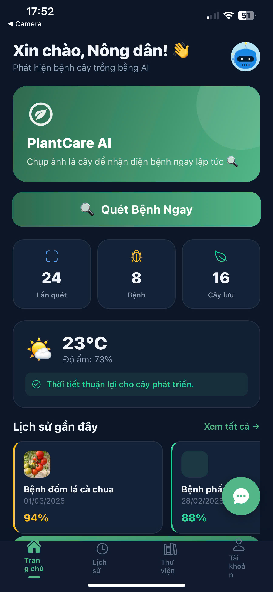
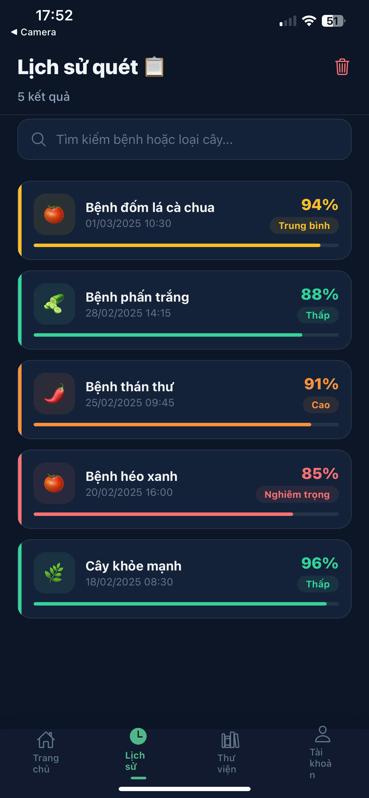
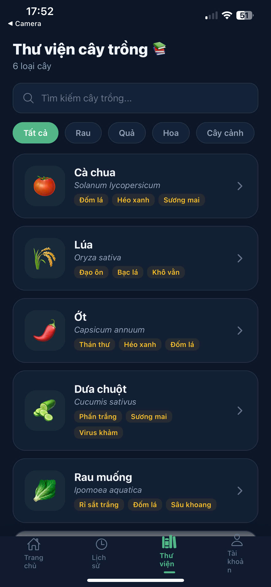
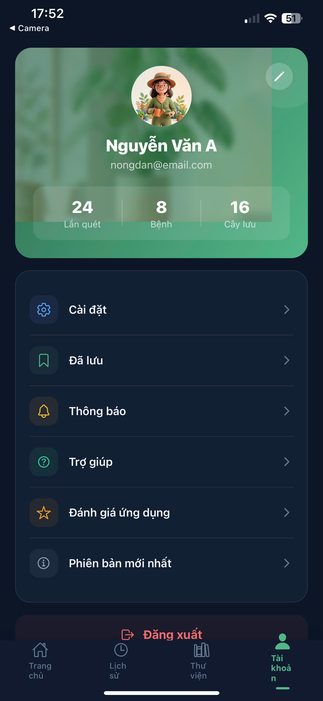

# 🌿 PlantCare AI - Trợ Lý Chăm Sóc Cây Thông Minh

Ứng dụng di động cao cấp hỗ trợ chẩn đoán bệnh cây trồng bằng trí tuệ nhân tạo và quản lý chăm sóc cây toàn diện. Được xây dựng với **React Native**, ứng dụng mang lại trải nghiệm mượt mà với giao diện hiện đại (Premium UX/UI) tích hợp các hiệu ứng 3D và tính năng thông minh thực tế.

---

## 📸 Giao diện ứng dụng (App Screenshots)

|  |  |  |
|:---:|:---:|:---:|
| *Màn hình Onboarding: Giới thiệu ứng dụng* | *Màn hình chính: Tổng quan khu vườn & thời tiết* | *Giao diện quét: Chụp ảnh cây bệnh bằng AI* |

|  |  |  |
|:---:|:---:|:---:|
| *Kết quả chẩn đoán: Triệu chứng & cách xử lý* | *Nhật ký cây trồng: Quản lý danh sách cây* | *Cài đặt & Hồ sơ: Tùy chỉnh trải nghiệm* |

---

## ✨ Các tính năng đã hoàn thiện (Current Features)

### 1. Phân tích & AI chẩn đoán (UI Flow)
*   **Màn hình Rà quét**: Giao diện quét thực tế (Mock).
*   **Hiệu ứng Loading AI**: Sử dụng Lottie Animations và Skeleton Loaders mô phỏng quá trình trí tuệ nhân tạo bóc tách đặc trưng ảnh.
*   **Kết quả chẩn đoán tinh tế**: Vuốt ngang (Swipeable Tabs) mượt mà để xem các thẻ: *Triệu chứng*, *Cách điều trị*, *Phòng ngừa*. Hiển thị phần trăm chuẩn xác (Confidence Score).
*   **Trợ lý ảo AI (Draggable Chatbot)**: Giao diện Chatbot có thể nắm, kéo, thả (Drag & Drop) sinh động ở màn hình Home.

### 2. Quản lý Chăm sóc & Vườn cây (Plant Diary)
*   **Nhật ký Khu vườn cá nhân**: Giao diện "Bottom Sheet" thêm thông tin cây mượt mà. 
*   **Màn hình Chi tiết Cây Cao Cấp**: Header 3D (Cây Monstera) mượt mà, hiển thị chi tiết "Lượng nước, Ánh sáng, Nhiệt độ" mô phỏng và phần theo dõi Lịch sử tự động hóa.
*   **Empty States (Màn hình trống) 3D**: Sử dụng hình ảnh 3D cho giao diện (Khu vườn trống, Lịch sử trống) tạo cảm giác thu hút.
*   **Màn hình Profile (Hồ Sơ)**: Tích hợp hình đại diện Nông dân 3D dễ thương, giao diện Glassmorphism (Kính mờ) trong suốt hiện đại sang trọng.
*   **Thư viện Cây**: Các thẻ Cây trồng phổ biến dạng bài báo để tham khảo.
*   **Thông tin Thời tiết (Real-time)**: Tích hợp Open-Meteo API lấy thông tin nhiệt độ/độ ẩm khu vực, dự đoán cách chăm sóc hoặc cảnh báo trước (có tính năng mặc định Hà Nội nếu từ chối vị trí).

### 3. Trải nghiệm & Tiện ích Khác (UX)
*   Thiết kế thẻ Kính mờ cực nịnh mắt (Glassmorphism).
*   Hỗ trợ tự động Dark/Light Mode.
*   Bố cục lưới, Responsive, Font Plus Jakarta Sans, Feedback haptic (Rung nhẹ khi click).
*   **Welcome Sceen (Onboarding)**: Giới thiệu ứng dụng cao cấp với các slide ảnh 3D chuyên nghiệp.

---

## 🔮 Các tính năng đang/chờ phát triển (Roadmap)

| Tính năng / Giai đoạn | Trạng thái | Mô tả chi tiết |
| :--- | :--- | :--- |
| **Tích hợp API AI (Backend)** | Đang phát triển | Sử dụng OpenAI Vision / FastAPI mô hình On-device trả về kết quả quét bệnh chuẩn xác từ Ảnh thay vì Mock Data. |
| **Authentication & Database** | Đang phát triển | Tích hợp Supabase (DB & Auth) quản lý và đồng bộ real-time tiến trình của người dùng. |
| **Hệ thống Push Notification** | Chưa bắt đầu | Tính toán chu kỳ tưới cây để tự động gửi "Thông báo đẩy" báo thức nhở tưới nước, bón phân. |
| **Mạng xã hội & Cộng đồng** | Chưa phát triển | Tab hiển thị chia sẻ thành tích trị bệnh cây, hỏi đáp kỹ thuật. |

---

## 🛠️ Công nghệ & Thư viện sử dụng

Toàn bộ Backend, UI/UX hiện tại đều được triển khai kết hợp các giải pháp sau:

| Công nghệ | Mô tả / Vai trò |
|---|---|
| **React Native (Expo SDK)** | Framework phát triển giao diện App và biên dịch chạy chéo (Cross-platform) Android/iOS. |
| **TypeScript** | Đảm bảo tính nhất quán (Type-Safety) và ổn định của mã nguồn. |
| **React Native Reanimated (v3)** | Xử lý các hiệu ứng chuyển động 60fps mượt mà chuyên sâu, Modal Sheet animations. |
| **React Native Gesture Handler** | Bộ xử lý thao tác kéo (Pan), chạm (Tap) để vuốt ảnh và kéo Chatbot FAB. |
| **Zustand** | Quản lý state gọn nhẹ (Global State) thông minh. |
| **Lottie React Native**| Chạy file ảnh vector chuyển động JSON chuyên dụng (Loading, Scanning). |
| **Open-Meteo API** | Lấy thông tin thời tiết thời gian thực không yêu cầu xác thực API Token, hoàn toàn tự do. |
| **Expo Location** | Xác thực trích xuất vị trí User làm dữ liệu đầu vào. |
| **Expo Blur** | Xử lý hiệu ứng giao diện kính mờ (Glassmorphism BlurView). |
| **Vector Icons** | Hệ thống Icon tiêu chuẩn tích hợp IonIcons của React Native. |

---

## 🚀 Hướng dẫn khởi chạy (Run for Dev)

```bash
# 1. Clone dự án
git clone <repository-url>
cd PlantCare_AI

# 2. Cài đặt thư viện
npm install

# 3. Khởi chạy Server
npm start
```

Nhấn `a` để chạy trên Android Emulator, Nhấn `i` để khởi động iOS Simulator. Quét mã QR bằng ứng dụng **Expo Go** để trải nghiệm trên điện thoại thật.
